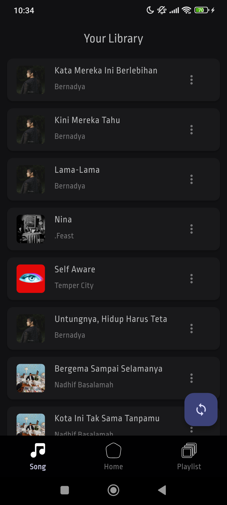
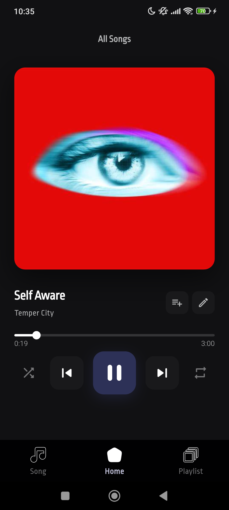
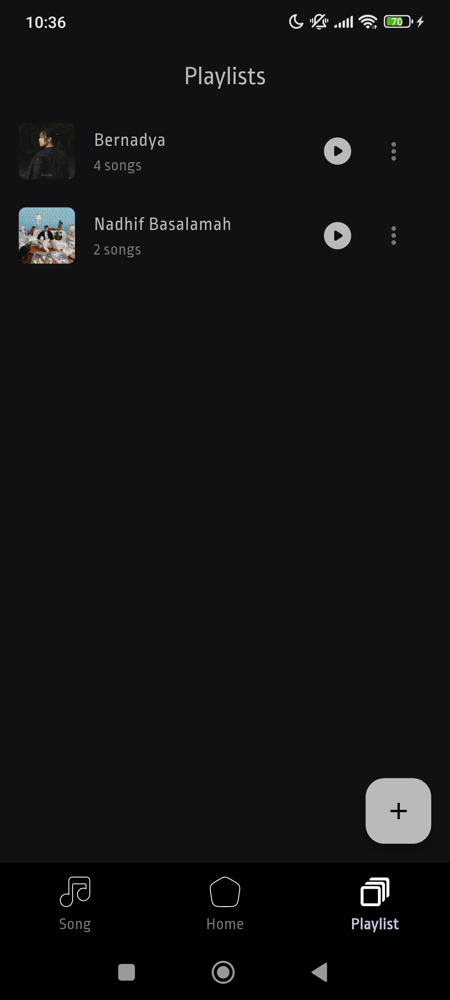

<<<<<<< HEAD
# Sonus

Sonus is a local music player built with Flutter. It scans a folder on your device, builds a song library, lets you create playlists, and allows you to edit song metadata and cover art directly inside the app.

## Features

- Scan a selected music folder and index audio files automatically
- Browse your full song library
- Play songs from the library or from a playlist
- Create, rename, and delete playlists
- Add or remove songs from playlists
- Edit song title, artist, and cover image
- Support for common local audio formats such as `.mp3`, `.wav`, `.flac`, and `.m4a`
- Persistent local storage with Hive
- Background audio support via `just_audio` and `audio_service`
- Android and iOS project setup included

## Tech Stack

- Flutter
- Dart
- Hive / Hive Flutter
- just_audio
- audio_service
- just_audio_background
- file_picker
- permission_handler
- on_audio_query
- audio_video_progress_bar

## Screenshots

<p align="center">
  
  
  
</p>

Example:

```md


```

## Project Structure

```text
sonus/
├── android/
├── ios/
├── assets/
│   ├── fonts/
│   ├── images/
│   └── svg/
├── lib/
│   ├── models/
│   ├── pages/
│   ├── services/
│   ├── theme/
│   ├── utils/
│   └── widgets/
├── web/
├── pubspec.yaml
└── README.md
```

## How It Works

When the app is opened for the first time, Sonus asks you to select a music folder. After that, it scans the folder recursively, finds supported audio files, reads metadata when available, and saves the results locally. The library is stored in Hive so the app can keep your songs and playlists across sessions.

## Supported Audio Formats

- MP3
- WAV
- FLAC
- M4A

## Permissions

Sonus requests device permissions needed to access media files and folders. Depending on the platform and Android version, the app may request:

- Storage access
- Audio/media access
- Photos access for cover image selection

## Getting Started

### Prerequisites

- Flutter SDK installed
- A connected Android or iOS device, or an emulator/simulator

### Installation

```bash
git clone https://github.com/harryhutapea/sonus.git
cd sonus
flutter pub get
```

If you need to regenerate Hive adapters:

```bash
flutter pub run build_runner build --delete-conflicting-outputs
```

### Run the app

```bash
flutter run
```

## Usage

1. Open the app for the first time.
2. Choose the folder that contains your music files.
3. Wait while Sonus scans and builds your library.
4. Go to the Songs tab to browse all tracks.
5. Tap a song to start playback.
6. Go to the Playlists tab to create or manage playlists.
7. Use the song editor to update title, artist, or cover art.

## Notes

- Sonus is designed around local files, not streaming.
- Custom song names and cover images are saved locally.
- If a file is removed from your device, the app can remove the matching song entry during the next sync.

## License

This project is licensed under the MIT License.

## Author

Harry Bonthor Hutapea